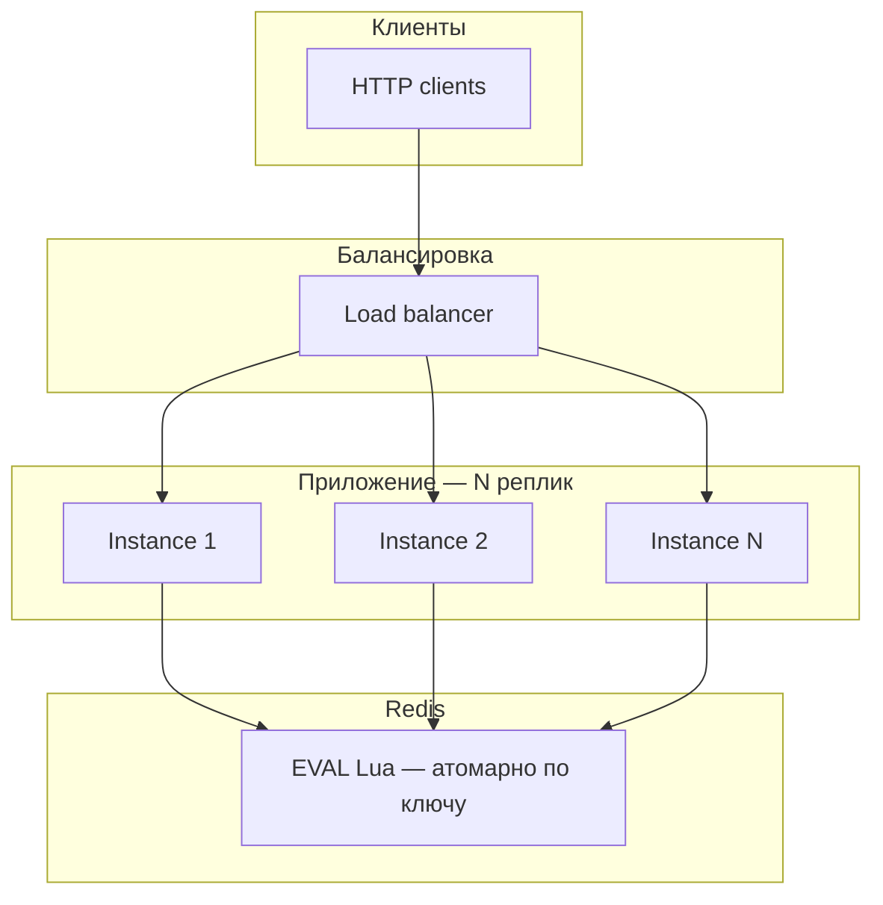

# Rate Limiter Middleware

[](https://github.com/MTDpo/Rate_limiter/actions/workflows/ci.yml)
[](https://goreportcard.com/report/github.com/MTDpo/Rate_limiter)
[](https://pkg.go.dev/github.com/MTDpo/Rate_limiter)

HTTP middleware для ограничения количества запросов от одного пользователя/IP за период времени. Production-ready: structured logging, health probes, fail-open, Docker non-root.

## Архитектура

Несколько **stateless** инстансов приложения и один общий **Redis** — единый источник правды для счётчиков. Ограничение выполняется в middleware до бизнес-логики; метрики и health обходят лимитер.



Кратко по потоку запроса: **Request ID** (внешний слой) → **Recovery** → **Prometheus** → **Rate limit** (Redis) → маршруты `/`, `/live`, `/ready`, …

## Распределённый rate limit

- **Несколько инстансов.** Все реплики ходят в **один Redis** с одинаковым префиксом ключей (`rate_limit:…`, `rate_limit:sw:…`, `rate_limit:lb:…`). Лимит считается **глобально по ключу** (например, по IP), а не «на процесс».
- **Согласованность (consistency).** Операции лимитирования выполняются как **Lua-скрипты** (`EVAL`): на стороне Redis это одна неделимая последовательность команд для данного ключа. При работе **только с master** (запись + выполнение скрипта) для успешно применённых команд получаем **последовательную согласованность** по ключу. Чтение с **replica** может отставать от master — для строгих лимитов скрипты нужно выполнять **на primary**, как в этом проекте. При **failover** Redis возможен краткий разрыв и смена primary; счётчики могут на одном двухзначном проценте запросов вести себя менее предсказуемо — типичный компромисс для внешнего стора.
- **Race conditions.** Если бы инстансы делали **чтение состояния → вычисление в Go → запись** без атомарности, два процесса могли бы одновременно увидеть «ещё есть слот» и **оба** пропустить запрос, **раздувая** фактический RPS. Здесь вся логика **внутри одного Lua-запроса** к Redis, поэтому класс гонок «между инстансами на RMW» снимается.

## Сравнение алгоритмов

| Алгоритм | Суть | Плюсы | Ограничения |
|----------|------|-------|-------------|
| **Token bucket** | «Кошелёк» токенов: пополнение с постоянной скоростью, заявка снимает 1 токен | Допускает **короткие всплески** до ёмкости, предсказуемая средняя скорость | Всплеск до `capacity` может быть «резким» |
| **Sliding window** | В окне времени хранится лог событий (sorted set); считаются только записи в последние `window` | Ближе к **ровному** «N запросов за последние T секунд», без жёсткой границы fixed window | Больше памяти на ключ при больших лимитах и длинном окне |
| **Leaky bucket** | Накопленный «объём» заявок **утекает** с фиксированной скоростью; превышение ёмкости → отказ | Сглаживает нагрузку, жёстче к всплескам, похоже на очередь с постоянной «дыркой» | Меньше мгновенного burst, чем у token bucket при той же средней скорости |

Переключение: переменная окружения `RATE_LIMIT_ALGORITHM` — `token_bucket` (по умолчанию), `sliding_window`, `leaky_bucket`.

## Challenges

- **Redis latency** → клиент с **`REDIS_TIMEOUT`** на чтение/запись/диал и **`REDIS_RETRIES`** + backoff (`REDIS_MIN_BACKOFF` / `REDIS_MAX_BACKOFF`) на транзиентные сетевые сбои.
- **Redis down / errors** → **`RATE_LIMIT_FAIL_OPEN`**: при ошибке Redis middleware может **пропускать** трафик (или при `false` отвечать 500 — политика «fail-closed»).

## Возможности

- **Три алгоритма:** Token Bucket, Sliding Window (лог в ZSET), Leaky Bucket (уровень + утечка)
- **Redis** — хранение с Lua-скриптом, retry, таймауты
- **429 Too Many Requests** — JSON-ответы с Request-ID
- **Fail-open** — при недоступности Redis пропускает трафик (настраивается)
- **Health probes** — `/live` (liveness), `/ready` (readiness + Redis check)
- **Structured logging** — JSON (slog)
- **Prometheus метрики** — решения, латентность, статусы
- **Graceful shutdown** — SIGINT/SIGTERM, настраиваемый таймаут
- **Request ID** — X-Request-ID для трассировки
- **Recovery** — перехват panic, 500 с логированием

## CI/CD

В репозитории настроен [GitHub Actions](.github/workflows/ci.yml): **`go test -race ./...`** (с сервисом **Redis**) и **golangci-lint v2** ([`.golangci.yml`](.golangci.yml)).

## Быстрый старт

### Локально (нужен Redis)

```bash
docker run -d -p 6379:6379 redis:7-alpine
go run ./cmd/server
```

Конфиг берётся из **переменных окружения процесса** (`HTTP_ADDR`, `REDIS_ADDR`, …). Файл **`.env` приложение сам не читает** — это только удобный шаблон рядом с [`.env.example`](.env.example): можно скопировать в `.env` и подставить значения в shell/IDE/Docker, либо задать `export` вручную. Секреты в репозиторий не коммитьте (`.env` в [`.gitignore`](.gitignore)).

### Docker Compose

```bash
docker compose up --build
```

| Endpoint | Описание |
|----------|----------|
| http://localhost:8080 | API |
| http://localhost:8080/live | Liveness probe (k8s) |
| http://localhost:8080/ready | Readiness probe (проверка Redis) |
| http://localhost:8080/health | Alias для readiness |
| http://localhost:9090/metrics | Prometheus |

## Конфигурация

Список переменных — в [`.env.example`](.env.example) (как шпаргалка). В рантайме используются только переменные окружения, см. выше.

| Переменная | По умолчанию | Описание |
|------------|--------------|----------|
| `HTTP_ADDR` | :8080 | HTTP-сервер |
| `METRICS_ADDR` | :9090 | Prometheus |
| `REDIS_ADDR` | localhost:6379 | Redis |
| `REDIS_TIMEOUT` | 3s | Таймаут операций Redis |
| `REDIS_RETRIES` | 3 | Повторы при ошибках |
| `RATE_LIMIT_ALGORITHM` | token_bucket | `token_bucket` \| `sliding_window` \| `leaky_bucket` |
| `RATE_LIMIT_CAPACITY` | 100 | Ёмкость / max запросов в окне (для sliding) |
| `RATE_LIMIT_REFILL` | 1.67 | Токены/с (token bucket) или утечка/с (leaky bucket); для sliding не обязателен |
| `RATE_LIMIT_WINDOW` | 1m | Длина окна (только `sliding_window`) |
| `RATE_LIMIT_KEY_TTL` | 120 | TTL ключей в Redis (сек); для sliding должен быть ≥ длины окна + 1s |
| `RATE_LIMIT_FAIL_OPEN` | true | При ошибке Redis: пропускать трафик |
| `SHUTDOWN_TIMEOUT` | 15s | Таймаут graceful shutdown |
| `LOG_LEVEL` | info | debug, info, warn, error |

## Kubernetes

```yaml
livenessProbe:
  httpGet:
    path: /live
    port: 8080
  initialDelaySeconds: 5
  periodSeconds: 10
readinessProbe:
  httpGet:
    path: /ready
    port: 8080
  initialDelaySeconds: 2
  periodSeconds: 5
```

## API

Успешный ответ:
```json
{"status":"ok"}
```

Ошибка 429:
```json
{"error":"Too Many Requests","code":429,"request_id":"a1b2c3d4"}
```

Заголовок `X-Request-ID` в ответе для трассировки.

## Benchmark & Load Test

```bash
# Redis должен быть запущен
go test -bench=. -benchmem ./internal/limiter/... ./internal/middleware/...

go run ./scripts/loadtest.go -url http://localhost:8080 -n 1000 -c 50
```

## Lint

```bash
golangci-lint run
```

## Структура проекта

```
Rate_limiter/
├── .github/workflows/ci.yml
├── cmd/server/main.go
├── internal/
│   ├── api/errors.go
│   ├── config/config.go
│   ├── health/health.go
│   ├── limiter/
│   │   ├── lua/           # token_bucket.lua, sliding_window.lua, leaky_bucket.lua
│   │   ├── token_bucket.go
│   │   ├── sliding_window.go
│   │   └── leaky_bucket.go
│   ├── logger/logger.go
│   ├── middleware/
│   │   ├── rate_limiter.go
│   │   ├── request_id.go
│   │   └── recovery.go
│   └── metrics/
├── scripts/loadtest.go
├── .env.example
├── .golangci.yml
├── Dockerfile
└── docker-compose.yml
```
